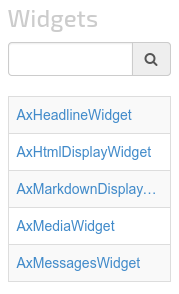

# ax-widget-browser-widget
The AxWidgetBrowserWidget displays a list of all widget and activities and lets the user select one.
It publishes several resources with data about the selected widget.
It gets the data from the location of the widget by assuming that the widget has the standard [LaxarJS widget files](https://github.com/LaxarJS/laxar/blob/master/docs/manuals/widgets_and_activities.md#widget-files).

## Content
* [Appearance](#appearance)
* [Usage](#usage)
* [Features](#features)
* [Integration](#Integration)
* [References](#references)

## Appearance


The AxWidgetBrowserWidget displays a list with widgets, a headline and input field for filtering the shown list.


In this example the user searched for the word *widget* and has select the fourth entry *AxMediaWidget*.
The search term is highlighted in the entries of the filtered list.


## Usage

### Installation
For installation instruction take a look at the [LaxarJS documentation](https://github.com/LaxarJS/laxar/blob/master/docs/manuals/installing_widgets.md).


### Configuration example
```json
{
   "widget": "widget-browser/ax-widget-browser-widget",
   "features": {
      "list": {
         "resource": "widgetList"
      },
      "select": {
         "parameter": "widgetId",
         "information": {
            "resource": "information"
         },
         "bower": {
            "resource": "bower"
         },
         "documentation": {
            "resource": "documentation"
         },
         "testRunner": {
            "resource": "testRunner"
         }
      }
   }
}
```

Use this configuration on a page to get an AxWidgetBrowserWidget instance.
The value of `parameter` has to be the same like defined in the flow definition.
For more information how to configure the flow and places with parameters visit the [LaxarJS] documentation.
The AxWidgetBrowserWidget displays a list with widgets from the resource `widgetList` published by another widget or activity.
In case of a selection the AxWidgetBrowserWidget loads data of the selected widget and publishes several resources with the data depended of the configuration.
In this example the AxWidgetBrowserWidget publishes the resources `information`, `bower`, `documentation` and `testRunner`.

For full configuration options refer to the [widget.json](widget.json).

## Features

### 1. Display a Selectable List of Widgets (list)
*R1.1* The AxWidgetBrowserWidget MUST allow a configuration of a list resource.
It MUST act as a *slave* of the resource according to the master/slave pattern.
The resource MUST have a list `widgets` where every entry has a string `name` with the name of a widget and a string `specification` with the location of the `widget.json`.
This location without the part `widget.json` is the *widget location prefix*.

*R1.2* The AxWidgetBrowserWidget MUST display a selectable list with all widgets and activities from the list resource.

### 2. Select a Widget (select)
*R2.1* The widget MUST require the configuration of a parameter to support the ability to bookmark a selection.

*R2.2*. The widget MUST allow a configuration of a list with place parameters which the widget MUST overwrite.

*R2.3* The widget MUST allow a configuration of a information resource.
It MUST act as the *master* of the resource according to the master/slave pattern.
If the resource topic is configured and the user selects a widget from the list, the AxWidgetBrowserWidget MUST publish a resource with the content of the `widget.json`.
The widget MUST get the content of the `widget.json` from the location stored in the list resource.

*R2.4* The widget MUST allow a configuration of a bower resource.
It MUST act as the *master* of the resource according to the master/slave pattern.
If the resource topic is configured and the user selects a widget from the list, the AxWidgetBrowserWidget MUST publish a resource with the content of the `bower.json`.
The widget MUST get this content from the HTTP resource by completing the widget location prefix with the part `bower.json`.

*R2.5* The AxWidgetBrowserWidget MUST allow a configuration of a list with file names of the widgets documentation file and a documentation resource.
It MUST act as the *master* of the resource according to the master/slave pattern.
When the user selects a widget, the AxWidgetBrowserWidget MUST publish a resource with the link to the documentation of the selected widget.
The AxWidgetBrowserWidget MUST check whether the first entry of the configured list exists as an HTTP resource by completing the widget location prefix with the first entry.
If the file doesn't exist the AxWidgetBrowserWidget MUST check the next entry of the configured list.
The format of the resource MUST be structured in accordance with HAL.
The link MUST be stored inside the object `_links` under the relation `markdown`.

*R2.6* The widget MUST allow a configuration of a testRunner resource.
It MUST act as the *master* of the resource according to the master/slave pattern.
If the resource topic is configured and the user selects a widget from the list, the AxWidgetBrowserWidget MUST publish a resource with the link to the `spec_runner.html` page.
The widget MUST compose the link by completing the widget location prefix with the part `spec/spec_runner.html`.

*R2.7* If a error encounters during the readout of information about the widget for one of the configured resources, the AxWidgetBrowserWidget MUST publish a `didEncounterError` event and replace the correspondent resource with an empty object or empty link.


## Integration

### Patterns
The widget supports the following event patterns as specified by the [LaxarJS Patterns] document.

#### Resources

* Resource: list.resource
* Role: Slave
* Access: Read
* Description: The source list with widgets and activities to display in the browser list.
* Data: The resource MUST have a relation `widgets` with a list with entries with following structure:
   * name
      * String
      * Widget name in underscore_case
   * specification
      * String
      * Location of the `widget.json` file

* Resource: select.information.resource
* Role: Master
* Access: Write
* Description: Publish a resource with the content of the `widget.json` of the selected widget.

* Resource: select.bower.resource
* Role: Master
* Access: Write
* Description: Publish a resource with the content of the `bower.json` of the selected widget.

* Resource: select.documentation.resource
* Role: Master
* Access: Write
* Description: Publish a resource with a link to one of the configured markdown files in the directory of the selected widget.

* Resource: select.testRunner.resource
* Role: Master
* Access: Write
* Description: Publish a resource with the url to the spec runner of the selected widget.


## References
The following resources are useful or necessary for the understanding of this document.
The links refer to the latest version of the documentation.
Refer to the bower.json for the specific version that is normative for this document.

* [LaxarJS Concepts]
* [LaxarJS Patterns]

[LaxarJS Concepts]: https://github.com/LaxarJS/laxar/blob/master/docs/concepts.md "LaxarJS Concepts"
[LaxarJS Patterns]: https://github.com/LaxarJS/laxar_patterns/blob/master/docs/index.md "LaxarJS Patterns"


