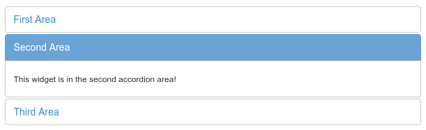

# laxar-accordion-widget [](https://travis-ci.org/LaxarJS/laxar-accordion-widget)

> LaxarJS widget written in AngularJS v1 that provides multiple widget areas in the form of an accordion


## Content

* [Appearance](#appearance)
* [Usage](#usage)
* [Features](#features)
* [Integration](#integration)
* [References](#references)


## Appearance


A laxar-accordion-widget with three areas.
The second area is selected and its widget area is visible.


## Usage

### Installation

For use within LaxarJS v1 projects:

```console
npm install laxar-accordion-widget
```


### Configuration Example

```json
{
   "widget": "laxar-accordion-widget",
   "id": "outerAccordion",
   "features": {
      "areas": [
         {
            "name": "first",
            "flag": "firstArea",
            "i18nHtmlLabel": {
               "en": "First Area",
               "de": "Erster Bereich"
            }
         },
         {
            "name": "second",
            "flag": "secondArea",
            "i18nHtmlLabel": {
               "en": "Second Area",
               "de": "Zweiter Bereich"
            }
         },
         {
            "name": "third",
            "flag": "thirdArea",
            "i18nHtmlLabel": {
               "en": "Third Area",
               "de": "Dritter Bereich"
            }
         }
      ]
   }
}
```

Use this configuration on a page for a laxar-accordion-widget instance with three areas.

For full configuration options refer to the [widget.json](widget.json).


## Features

### 1. Display Areas with Tabs (areas)

*R1.1* The widget MUST display a configurable list of widget areas.

*R1.2* The widget MUST display a panel with an internationalized title for each widget area.

*R1.3* The widget MUST allow to configure a flag for each area.
If an area is activated the flag MUST be published as `true`.
The flag of the area which is deactivated now MUST be published as `false`.

*R1.4* The widget MUST initially publish all configured visibility flags when receiving the `beginLifecycleRequest` event.

*R1.5* For each title it MUST be configurable if it is marked as anonymized.
By default titles are not marked as anonymized.

*R1.6* For each area a flag MUST be configurable to indicate an error state for the given panel.
An error state MUST be visualized through a CSS class.

*R1.7* The widget MUST allow to disable an area though a flag.
An area which is disabled does not react to user interaction or selection events and MUST use a special CSS class to display its state.

*R1.8* It MUST be possible to *tag* an area.
The tag MUST be controlled by a flag for each area and MUST be displayed through the CSS class `is-tagged`.

*R1.9* The widget MUST handle visibility requests `(changeAreaVisibilityRequest)` for the provided widget areas in relation to its own visibility.

*R1.10* When changing the selection, the widget MUST send new visibility requests for the affected widget areas.

*R1.11* A panel MUST be selectable by a mouse click.
The widget MUST handle the mouse click as a selection request and focus the area or may refuse the request depending on further validation.

*R1.12* The accordion and the selected panel MUST be focusable (e.g. using the tab key).
The focused panel MUST be emphasized graphically.

*R1.13* If the accordion is focused, the previous panel and the next panel MUST be selectable by the "cursor up" key and the "cursor down" key respectively.
The widget MUST handle this user interaction as a selection request and MUST refuse the request if applicable.

*R1.14* The selected panel MUST be emphasized according to the theme.

*R1.15* When the widget changes the selection, the widget MUST show the corresponding area and hide the former selected area.

*R1.16* The widget MUST allow to configure a *selection action*.
When the widget changes the selection it MUST publish the related `willTakeAction` and `didTakeAction` events for this action.


### 2. Ask for Selection Confirmation (areas.\*.selectionRequest)

*R2.1* The widget MUST allow the configuration of a *selection request action*.
This selection request action allows other widgets and activities to have influence on the selection.

*R2.2* If no selection request action is configured, every selection request MUST be fulfilled and the selection MUST be performed.

*R2.3* If a selection request action was configured, the widget MUST trigger the action when a selection request happened (by publishing a `takeActionRequest-Event`).
The further handling of the selection request MUST be interrupted until confirmation is received.

*R2.4* The widget MUST allow the configuration of a *confirm action*.
If a selection request action and a confirm action are configured, the widget MUST perform the selection when it receives a `takeActionRequest` for the confirm action.

*R2.5* If the widget receives a `takeActionRequest` event for the confirm action but no selection request was triggered for the associated panel, the widget MUST ignore the event.


### 3. Allow to Change the Selection Using Actions (areas.\*.selectionRequestTrigger)

*R3.1* The widget MUST allow the configuration of a list of *selection request trigger actions*.
These actions allow other widgets and activities to trigger a selection request.

*R3.2* If no selection request action is configured (R1.15) the widget MUST perform the selection directly when one selection request trigger action event is received.


### 4. Support Internationalization (i18n)
*R4.1* The widget MUST allow the configuration of a locale as described in the documentation to LaxarJS i18n. When displaying internationalized content, the widget MUST use the current language tag of the locale.


## Integration

### Patterns

The widget supports the following event patterns as specified by the [LaxarJS Patterns] document.


#### Actions

* Action: `areas[*].selectionRequest.action`
   * Role: Sender
   * Description: Sending a selection request.


* Action: `areas[*].selection.action`
   * Role: Sender
   * Description: Sending that a selection took place.


* Action: `areas[*].selectionRequestTrigger.action`
   * Role: Receiver
   * Description: Receiving a selection request.


* Action: `areas[*].selectionRequest.confirmationAction`
   * Role: Receiver
   * Description: Receiving the confirmation of the selection request.


#### Flags

* Flag: `areas[*].validOn`
   * Role: Receiver
   * Description: Receiving a signal if an area has an error state.


* Flag: `areas[*].disabledOn`
   * Role: Receiver
   * Description: Receiving a signal if an area should be deactivated.


* Flag: `areas[*].taggedOn`
   * Role: Receiver
   * Description: Receiving a signal if an area should be tagged.


* Flag: `areas[*].flag`
   * Role: Sender
   * Description: Sending a signal if an area changed it visibility.


## References

The following resources are useful or necessary for the understanding of this document.
The links refer to the latest version of the documentation.
Refer to the [bower.json](bower.json) for the specific version that is normative for this document.

* [LaxarJS Concepts]
* [LaxarJS Patterns]
* [LaxarJS i18n]

[LaxarJS Concepts]: https://github.com/LaxarJS/laxar/blob/master/docs/concepts.md "LaxarJS Concepts"
[LaxarJS Patterns]: https://github.com/LaxarJS/laxar_patterns/blob/master/docs/index.md "LaxarJS Patterns"
[LaxarJS i18n]: https://github.com/LaxarJS/laxar/blob/master/docs/manuals/i18n.md "LaxarJS i18n"
