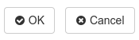

# laxar-command-bar-widget [](https://travis-ci.org/LaxarJS/ax-command-bar-widget)

AngularJS v1 widget that allows a user to trigger actions (such as navigation) using graphical buttons.
The widget provides some default buttons for navigation.


## Content

* [Appearance](#appearance)
* [Usage](#usage)
* [Features](#features)
* [Integration](#integration)
* [References](#references)

## Appearance



A laxar-command-bar-widget with two default buttons.


## Usage


### Installation

In a LaxarJS v2 installation with AngularJS v1 adapter, simply run:

```console
npm install laxar-command-bar-widget
```


### Configuration Example

```json
{
   "widget": "laxar-command-bar-widget",
   "features": {
      "cancel": {
         "enabled": true,
         "action": "cancelSomething"
      },
      "ok": {
         "enabled": true,
         "action": "confirmSomething"
      }
   }
}
```
Use this configuration on a page to get a laxar-command-bar-widget instance with the two default buttons "ok" and "cancel".

For full configuration options refer to the [widget.json](widget.json).


## Features

### 1. Display a Button Bar (areas)

*R1.1* The widget MUST display a button bar in a row with three anchors (left, center, right) for the buttons.

*R1.2* It MUST be possible to configure a button list for each of the anchors.

*R1.3* The widget MUST display a default space between the buttons.
The width of the space is defined by the theme.

*R1.4* A button bar on the left anchor position MUST be align to the left border of the widget.
A button bar in the center MUST be placed in the center of the widget.
A button bar on the right anchor position MUST be aligned to the right border of the widget.

*R1.5* If the available space is no enough, the button bars SHOULD be placed below each other.
The position requirement (left, center, right) of the button bars is OPTIONAL in this case.

*R1.6* The widget MUST allow a configuration of an absolute width in grid columns for a button bar.
This configuration allows a better handling of special cases of partitioning of the buttons.


### 2. Display Configurable Buttons (buttons)

*R2.1* It MUST be possible to enable or disable each button by configuration.

*R2.2* Each button text MUST be configurable. The configured text MUST be interpreted as internationalized HTML content.
It MUST be possible to use icons as labels.

*R2.3* For each button an *access key* MUST be configurable to allow the control by keyboard [MDN accesskey].

*R2.4* For each button the position and the anchor position MUST be configurable.
The buttons position MUST be determined by the configured zero-based index and by the position of the button configuration.

*R2.5* The widget MUST allow the configuration of the button class (normal, primary, info, success, warning, danger, inverse, link).

*R2.6* The size of a button (mini, small, default, large) MUST be configurable.

*R2.7* Each button MUST have a state (disabled, hidden, omitted or normal).
The state of a button MUST depend on the page state (signaled through flags).
If several flags are defined for a state, the state MUST be activated when one flag is at least true.

*R2.8* In relation to the page state (signaled through flags, e.g. while a action is performed) a spinner SHOULD be displayed.
In this case a CSS class *is-busy* MUST be set to allow to complement the label with a spinner.

*R2.9* Each button MUST have an unique page-wide ID.
When a button or its associated `access key` is pressed, the widget MUST publish a `takeActionRequest` event with a key `anchorDomElement` with the DOM ID of the button as value.


### 3. Display Default Buttons (previous, next, finish, ok, cancel, close, info, help, print, apply, yes, no)

*R3.1* The widget MUST support default buttons.
The default buttons MUST act like the other custom buttons, but have default values for the configuration such as the label.

*R3.2* A default button with the same index as a custom button MUST be displayed before the custom button.


### 4. Layout (layout)

*R4.1* In default configuration the buttons are rendered side by side (horizontally).
It MUST be configurable to display the buttons below each other (vertically).


### 5. Support Internationalization (i18n)

*R5.1* The widget MUST allow the configuration of a *locale* as described in the documentation to [LaxarJS i18n].
When displaying internationalized content, the widget MUST use the current language tag of the locale.


## Integration

### Patterns

The widget supports the following event patterns as specified by the [LaxarJS Patterns](#references) document.


#### Actions

* Action: `*.action`
   * Role: Sender
   * Description: Trigger this action if a button or a access key is pressed.


#### Flags

* Flag: `*.omitOn|hideOn|disableOn|busyOn`
   * Role: Receiver
   * Description: Change a button (hide, disable, omit or display a busy icon)


## References

The following resources are useful or necessary for the understanding of this document.
The links refer to the latest version of the documentation.
Refer to the [bower.json](bower.json) for the specific version that is normative for this document.

* [LaxarJS Concepts]
* [LaxarJS Patterns]
* [LaxarJS i18n]
* [MDN GlobalAttributes]

[LaxarJS Concepts]: https://github.com/LaxarJS/laxar/blob/master/docs/concepts.md "LaxarJS Concepts"
[LaxarJS Patterns]: https://github.com/LaxarJS/laxar_patterns/blob/master/docs/index.md "LaxarJS Patterns"
[LaxarJS i18n]: https://github.com/LaxarJS/laxar/blob/master/docs/manuals/i18n.md "LaxarJS i18n"

[MDN GlobalAttributes]: https://developer.mozilla.org/en-US/docs/HTML/Global_attributes "Mozilla Developer Network: Global Attributes"
[MDN accesskey]: https://developer.mozilla.org/en-US/docs/Web/HTML/Global_attributes/accesskey "Mozilla Developer Network: accesskey"
