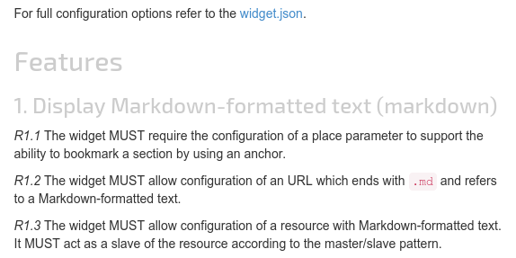

# laxar-markdown-display-widget [](https://travis-ci.org/LaxarJS/ax-markdown-display-widget)
The laxar-markdown-display-widget converts [Markdown]-formatted text to HTML content and displays it.


## Content
* [Appearance](#appearance)
* [Usage](#usage)
* [Features](#features)
* [Integration](#integration)
* [References](#references)

## Appearance


A laxar-markdown-display-widget displaying a part of this document.

## Usage

### Installation
For use with Laxar 2 projects:

```js
npm install laxar-markdown-display-widget
```

### Configuration example
```json
{
   "widget": "laxarjs/laxar-markdown-display-widget",
   "features": {
      "markdown": {
         "parameter": "anchor",
         "resource": "markdownResource",
         "attribute": "markdownText"
      }
   }
}
```

Use this configuration on a page to get an laxar-markdown-display-widget instance.
The value of `parameter` is used to generate internal anchors, and has to be the same as defined in the flow definition.
For more information how to configure the flow and places with parameters visit the [LaxarJS flow] documentation.

The widget gets the Markdown-formatted text from the resource `markdownResource`.
The widget expects the source under the relation `markdownText` and transforms it to HTML content and displays the result.

For full configuration options refer to the [widget.json](widget.json).

## Features

### 1. Display Markdown-formatted text (markdown)
*R1.1* The widget MUST require the configuration of a place parameter to support the ability to bookmark a section by using an anchor.

*R1.2* The widget MUST allow configuration of an URL which ends with `.md` and refers to a Markdown-formatted text.

*R1.3* The widget MUST allow configuration of a resource with Markdown-formatted text.
It MUST act as a slave of the resource according to the master/slave pattern.

*R1.4* The widget MUST allow configuration of a resource with a URL.
It MUST act as a slave of the resource according to the master/slave pattern.
The widget MUST expect the URL in the object `_links` and the relation `markdown` according to [HAL].
The URL MUST end with `.md` and refer to a Markdown-formatted text.

*R1.5* The widget MUST allow configuration of an attribute which refers to the Markdown-formatted text in the resource.
If no attribute is configured, the widget MUST expect a URL in the resource according to the requirement 1.4.

*R1.6* The widget MUST convert the Markdown-formatted text to HTML content and MUST display it.

*R1.7* The widget SHOULD display images with relative paths.

*R1.8* The widget SHOULD resolve hyperlinks with relative paths.

*R1.9* The widget MUST resolves links to anchors of headings.

*R1.10* If a resource and a URL are configured, the widget MUST display the content loaded from the URL until a resource with  a Markdown-formatted text or an URL to a Markdown-formatted text is published.

## Integration
### Patterns
The widget supports the following event patterns as specified by the [LaxarJS Patterns] document.

#### Resources
* Resource: `markdown.resource`
   * Role: Slave
   * Access: Read
   * Description: Contains the Markdown-formatted text or a URL which refers to a Markdown-formatted text.

## References
The following resources are useful or necessary for the understanding of this document.
The links refer to the latest version of the documentation.
Refer to the [bower.json](bower.json) for the specific version that is normative for this document.

* [LaxarJS Concepts]
* [LaxarJS Patterns]
* [LaxarJS i18n]
* John Gruber: [Markdown]
* Hypertext Application Language: [HAL]


[LaxarJS Concepts]: https://github.com/LaxarJS/laxar/blob/master/docs/concepts.md "LaxarJS Concepts"
[LaxarJS flow]: https://github.com/LaxarJS/laxar/blob/master/docs/manuals/flow_and_places.md "LaxarJS Flow and Places"
[LaxarJS Patterns]: https://github.com/LaxarJS/laxar_patterns/blob/master/docs/index.md "LaxarJS Patterns"
[LaxarJS i18n]: https://github.com/LaxarJS/laxar/blob/master/docs/manuals/i18n.md "LaxarJS i18n"
[Markdown]: http://daringfireball.net/projects/markdown/ "John Gruber: : Markdown"
[HAL]: http://stateless.co/hal_specification.html "Hypertext Application Language"
