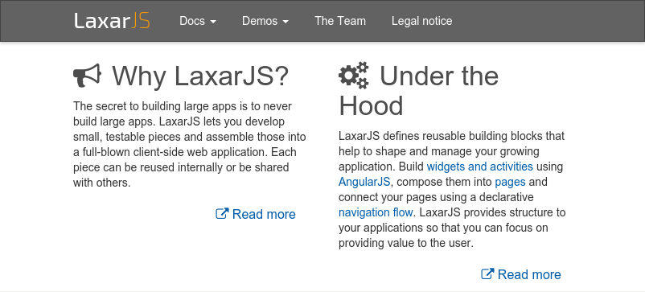

# laxar-media-widget [](https://travis-ci.org/LaxarJS/laxar-media-widget)
The laxar-media-widget displays media content such as an image or an external website with an optional title or an optional caption.
The widget gets the information about the type and source of the content from a resource.


## Content
* [Appearance](#appearance)
* [Usage](#usage)
* [Features](#features)
* [Integration](#integration)
* [References](#references)


## Appearance


The laxar-media-widget displaying an external website.


The laxar-media-widget displaying an image.


## Usage

### Installation
For installation instruction take a look at the [LaxarJS documentation](https://github.com/LaxarJS/laxar/blob/master/docs/manuals/installing_widgets.md).


### Configuration example
```json
{
   "widget": "laxar-media-widget",
   "features": {
      "medium": {
         "resource": "exampleContent"
      }
   }
}
```

Use this configuration on a page to get an laxar-media-widget instance.
The widget displays the content configured through the resource `exampleContent`.

For full configuration options refer to the [widget.json](widget.json).

Please note: The container which embeds the widget must have the CSS style `position: relative` and a fix value for the CSS attribute `height` to ensure that the height of the widget is defined through the container.


## Features
### 1. Display Media Content: Image or Website (medium)
*R1.1* The widget MUST load the media content and display it with a suitable HTML element.

*R1.2* Type and source of the content are received through a *document resource*.
The expected structure of the document resource are described in section [integration](#integration).
The laxar-media-widget MUST act as a slave of the resource according to the master/slave pattern.

*R1.3* The source of the content to be displayed is defined in the resource by a URL.

*R1.4* The type of the media content MUST comply with the MIME type according to [IETF RFC #822] which is defined in the resource.
The laxar-media-widget MUST support the following types and MAY support further types.

For Images: image/png, image/jpeg and image/gif.

For Websites: text/html and application/xhtml+xml plus application/pdf.

*R1.5* The laxar-media-widget MUST support the option to display a title received with the media resource as headline.
Independently of this option the laxar-media-widget MAY display a received title as an image tooltip.

*R1.6* The laxar-media-widget MUST support the option to display an image caption received with the media resource.

*R1.7* The laxar-media-widget MUST allow to configure an action to trigger display of the media content.


### 2. Adjust the Size to the Media Content (layout)
*R2.1* The laxar-media-widget MUST use the available width to determine the width of the media content *(size-to-container)*.

*R2.2* The widget MUST determine the height according to the width and the aspect ratio of the image (default behavior of the browser).

*R2.3* When displaying a website (size-to-container) the widget MUST use the whole available height (when using an `iframe`, the element should have the CSS style `height: 100%`).
If the height of the embedded website is bigger than the available height the widget MUST display a vertical scroll bar.
In the other case the scroll bar SHOULD NOT be displayed.
For the width a similar handling is expected.

*R2.4* The widget MUST allow the configuration of an option to determine the width and height of the presentation to the media content *(size-to-content)*.
In this case the image size is determined from the browser, whereas websites are adjusted dynamically using a script.

*R2.5* In case of the option size-to-content the media content MUST not overflow the available width.
If necessary the widget MUST display a horizontal scroll bar.
The widget MUST NOT display any unnecessary scroll bars.

*R2.6* It is not always possible to calculate the size of embedded websites (necessary for *R2.4*), because of constraints such as the same-origin policy.
For these cases the document resource MUST include the attributes `mediaInformation.pixelWidth` and `mediaInformation.pixelHeight`.
The widget MUST use these attributes if they are included in the resource and the layout size-to-content is configured.
The widget MUST interpret the given attribute values as minimum width and minimum height (if necessary with scroll bars inside the `iframe`).
In this case the widget MUST NOT overflow the given width.

*R2.7* If in case of the size-to-content layout a surveying of the embedded site is not possible and the media resource doesn't include the attribute `mediaInformation`, the widget MUST log a warning message and change to the layout size-to-container.

### 3. Integration with Embedded Website (integration)
*R3.1* If the laxar-media-widget is used to embed a website using an `iframe`, it MUST allow the HTML attribute `name` of the `iframe` element with a configuration parameter.
This enables the embedded website to recognize its integration into a LaxarJS application.
The embedded website is able to read the value through the DOM attribute `window.name` and display a special layout, for example one without navigation.

### 4. Fallback Presentation for not Supported Media Types (fallback)
*R4.1* If the current Browser does not allow the accurate presentation of a media type in an HTML element on the same site, the widget MUST display a link to the media content which MUST be opened in a new browser window.

Example:
The presentation of a PDF in an embedded frame is at some systems not satisfactorily possible.
In any touch interfaces the scrolling may not work.

*R4.2* The detection if a fallback presentation is necessary SHOULD be feature based.
The widget MAY execute a platform detection (with `navigator.platform`) to identify platform specific problems.
The widget SHOULD NOT interpret the user agent string.

*R4.3* The text of the fallback link MUST be configurable.

### 5. Support Internationalization (i18n)

*R5.1* The widget MUST allow the configuration of a locale as described in the documentation to [LaxarJS i18n].
When displaying internationalized content, the widget MUST use the current language tag of the locale.


## Integration
### Patterns
The widget supports the following event patterns as specified by the [LaxarJS Patterns] document.

#### Resources
* Resource: `medium.resource`
   * Role: Slave
   * Access: Read
   * Description: The resource with content to display.


The resource is expected to have at least the following attributes:

```
{
   location:  <string>,
   mimeType:  <string>,
   i18nName:  <string>?,
   i18nDescription:  <string>?,
   mediaInformation: {
      pixelWidth: int?,
      pixelHeight: int?,
      …
   }?
}
```

Here, the `location` is a valid URL according to [IETF RFC #1738] and the `mimeType` is one of the supported content types described in [IETF RFC #822].

Optional: If desired the `i18nName` (plaintext, itemized by language tag) will be displayed as the title.
If desired the `i18nDescription` (plaintext, itemized by language tag) will be displayed as the image caption.
If the size of the content cannot be calculated automatically the `mediaInformation` will be used (*R2.6*).

For compatibility with non-internationalized widgets, `name` and `description` are supported instead of `i18nName` and `i18nDescription`.

#### Actions
* Action: `medium.onActions`
   * Role: Receiver
   * Description: Causes the widget to display the media content.


## References
The following resources are useful or necessary for the understanding of this document.
The links refer to the latest version of the documentation.
Refer to the bower.json for the specific version that is normative for this document.

* [LaxarJS Concepts]
* [LaxarJS Patterns]
* [LaxarJS i18n]
* [IETF RFC #822]: Standard for the Format of ARPA Internet Text Messages
* [IETF RFC #1738]: Uniform Resource Locators (URL)

[LaxarJS Concepts]: https://github.com/LaxarJS/laxar/blob/master/docs/concepts.md "LaxarJS Concepts"
[LaxarJS Patterns]: https://github.com/LaxarJS/laxar_patterns/blob/master/docs/index.md "LaxarJS Patterns"
[LaxarJS i18n]: https://github.com/LaxarJS/laxar/blob/master/docs/manuals/i18n.md "LaxarJS i18n"
[IETF RFC #822]: http://www.ietf.org/rfc/rfc0822.txt "Standard for the Format of ARPA Internet Text Messages"
[IETF RFC #1738]: http://www.ietf.org/rfc/rfc1738.txt "Uniform Resource Locators (URL)"
