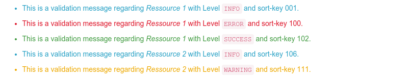

# laxar-messages-widget [](https://travis-ci.org/LaxarJS/laxar-messages-widget)

The laxar-messages-widget displays messages to the user, for example to communicate validation results like errors, warnings and hints.


## Content

* [Appearance](#appearance)
* [Usage](#usage)
* [Features](#features)
* [Integration](#integration)
* [References](#references)


## Appearance



Flat view without border and without button.


Flat view with enclosing Border and button to dismiss messages.


Each message individually, with its own border and button.


Messages are grouped by status class with a border and button per status class.


## Usage

### Installation

For installation instruction take a look at the [LaxarJS documentation](https://github.com/LaxarJS/laxar/blob/master/docs/manuals/installing_widgets.md).


### Configuration example

```json
{
   "widget": "laxarjs/laxar-messages-widget",
   "features": {
      "layout": {
         "variant": 1
      },
      "resource": {
         "list": []
      }
   }
}
```
Use this configuration on a page to get an laxar-messages-widget instance which displays messages regarding all resources of a page.

For full configuration options refer to the [widget.json](widget.json).


## Features

### 1. Display Messages (messages)

*R1.1* The widget MUST display messages, which are received with events.
The text of the message MUST be interpreted as HTML content.

*R1.2* The widget MUST provide different layouts: No border (alert), one border around all messages, a border around each message or around each status class.

*R1.3* The border MUST use the CSS class of the theme corresponding to its status class.
This requirement is not applicable to the layout with a border around all messages.

*R1.4* The widget MUST support different styles for the status classed SUCCESS, INFO, WARNING and ERROR.
For this purpose the widget MUST use CSS classes of the theme.

*R1.5* The widget MUST remember the status class of every message, which text should be displayed as HTML and which sort key the message has.

*R1.6* All messages of all sources MUST be summarized as a list of displayed messages.

*R1.7* The messages of the display list MUST be in the same order as the configuration of the resources and actions.
Messages about actions MUST appear before messages of resources in the list.
The messages for a single resource or action MUST be ordered by the sort keys of the messages.

*R1.8* Messages with the same message text MUST be summarized to one message.
The summarized message MUST have the top priority status class of the single messages according to the order (top priority first): ERROR, WARNING, INFO, SUCCESS.

*R1.9* If messages are summarized, the widget MUST sort the summarized message at the top-ranking position of all single summarized messages.


### 2. Dismiss Messages (dismiss)

*R2.1* It MUST be possible to disable this feature.

*R2.2* The widget MUST support a button (as icon) to hide all displayed messages when the button is clicked.

*R2.3* The button MUST be displayed in relation of the configured layout.
In case of the layout where the single messages or the status classes have each it own border, a button for each single message or status class MUST be displayed.
If there is a border around all messages, then there MUST be one button for all messages and all status classes.
In case of the layout without border, there MUST be no button and the hole feature is disabled.

*R2.4* If the messages are hidden, the widget MUST NOT change its internal state.
It MUST NOT publish an event with a change of its state.

*R2.5* When new messages are added, the widget MUST display them.
Messages which are hidden MUST stay hidden until they are renewed through events.
A suitable event is a `didValidate` event for the relevant resource.


### 3. Blank Presentation (blank)

*R3.1* The widget MUST be totally hidden if it has no messages.


### 4. Determine a Total Status (status)

*R4.1* The widget MUST determine a total status of one of the status classes: ERROR, WARNING, INFO, SUCCESS and BLANK.
The total status MUST be the one of the message with the status class with the top priority.
If some message has the status class ERROR, then the total status is ERROR.
If no message has the status class ERROR but some message has the status class WARNING, then the total status is WARNING.
The same goes for the status classes INFO and SUCCESS.
The total status is BLANK if no message was reported.

*R4.2* For every status (ERROR, WARNING, INFO, SUCCESS, BLANK) the name of a flag MUST be configurable which MUST be set in relation to the current status.

*R4.3* When determining the initial or a subsequent total status, the widget MUST publish the relevant status using a `didChangeFlag` event with a configurable name.
If no flag name is configured for the status the widget MUST NOT publish a `didChangeFlag` event.

*R4.4* When changing the total status the flag related to the old status MUST be unset and a appropriate `didChangeFlag` event MUST be published before publishing the new status.

*R4.5*: The widget MUST delete all messages and set its total status to BLANK, if one action from a configurable list of actions is triggered.


### 5. Administration of resources (resource)

*R5.1* The widget MUST allow to disable the feature through configuration.

*R5.2* The widget MUST allow the configuration of several resources, which include messages about change and validation.
If no resource is configured, the widget MUST listen to messages of all resources of the site (wildcard).

*R5.3* The widget MUST manage a separate list for every configured resource.

*R5.4* The widget MUST delete a list of messages for a resource, if a `validateRequest` event or a `didReplace` event for this resource is received.

*R5.5* When receiving a `validateRequest` event or a `didReplace` event for a parent resource, the widget MUST delete the lists of messages for any child resources (sub topics of the event bus).

*R5.6* The widget MUST extend the list of messages for a resource with all messages received within a `didValidate` event for the resource.

*R5.7* The widget MUST support an optional blacklist for the resources.
Messages about the resources of the blacklist MUST NOT be displayed.

*R5.8* The widget MUST NOT display subtopics of any excluded resources from the blacklist.

*R5.9* It MUST be configurable if messages for a resource MUST be deleted, when a message with status class `SUCCESS` about the resource is received.
The new `SUCCESS` messages MUST be displayed.


### 6. Display Errors (errors)

*R6.1* The widget MUST display errors which are reported through a `didEncounterError` event.
This errors MUST be displayed like validate messages with status class `ERROR`.

*R6.2* The widget MUST allow to deactivate this feature.

*R6.3* The widget MUST treat error messages like messages for another resource.


### 7. Support Internationalization (i18n)

*R7.1* The widget MUST allow the configuration of a locale as described in the documentation to [LaxarJS i18n].
When displaying the received internationalized validation messages (`didValidate` event with `i18nHtmlMessage`), the widget MUST use the current language tag of the locale.
The current language tag is received through a resource.


### 8. Auto Scroll the Messages into the Visible Area (autoScroll)

*R8.1* The widget MUST scroll the messages into the visible area of the browser window when receiving messages.
This feature MUST be configurable and disabled by default.


## Integration

### Patterns

The widget supports the following event patterns as specified by the [LaxarJS Patterns] document.


#### Resources

* Resource: `resource.list[ i ]`
   * Role: Slave
   * Access: Read
   * Description: Resource topic list.
   Empty list serves as catch-all, `null` disables the resource-feature.


#### Flags

* Flag: `status.(ERROR|WARNING|INFO|SUCCESS|BLANK).flag`
   * Role: Sender
   * Description: Set or unset the status of the widget


## References

The following resources are useful or necessary for the understanding of this document.
The links refer to the latest version of the documentation.
Refer to the bower.json for the specific version that is normative for this document.

* [LaxarJS Concepts]
* [LaxarJS Patterns]
* [LaxarJS i18n]

[LaxarJS Concepts]: https://github.com/LaxarJS/laxar/blob/master/docs/concepts.md "LaxarJS Concepts"
[LaxarJS Patterns]: https://github.com/LaxarJS/laxar_patterns/blob/master/docs/index.md "LaxarJS Patterns"
[LaxarJS i18n]: https://github.com/LaxarJS/laxar/blob/master/docs/manuals/i18n.md "LaxarJS i18n"
