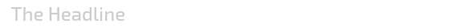
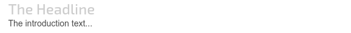
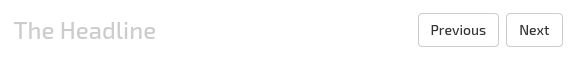
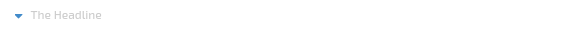

# ax-headline-widget [](https://travis-ci.org/LaxarJS/ax-headline-widget)
Shows a headline, possibly followed by a subtitle and/or buttons.


## Content
* [Appearance](#appearance)
* [Usage](#usage)
* [Features](#features)
* [Integration](#integration)
* [References](#references)


## Appearance
The style of the widget elements are mostly affected by the theme which defines the rendering of the headline and default HTML elements.



An ax-headline-widget with a headline with level 3.




An ax-headline-widget with a headline with level 3 and an intro text.




An ax-headline-widget with a headline with level 3 and two buttons on the right with default style .




An ax-headline-widget with a headline with level 6 and a button with a icon on the left and the style `LINK`.


## Usage

### Installation
For installation instruction take a look at the [LaxarJS documentation](https://github.com/LaxarJS/laxar/blob/master/docs/manuals/installing_widgets.md).


### Configuration example

```json
{
   "widget": "laxarjs/ax-headline-widget",
   "features": {
      "headline": {
         "level": 4,
         "i18nHtmlText": {
            "en-US": "Headline",
            "de-DE": "Überschrift"
         }
      },
      "intro": {
         "i18nHtmlText": {
            "en-US": "This is a intro text.",
            "de-DE": "Dies ist ein Introtext."
         }
      },
      "buttons": [
         {
            "action": "doSomething",
            "enabled": true,
            "i18nHtmlLabel": {
               "en-US": "Cancel",
               "de-DE": "Abbrechen"
            }
         }
      ]
   }
}
```
Use this configuration on a page to get an ax-headline-widget instance with a headline, an intro and a button on the right side of the headline.
If the button is pressed the widget publishes a `takeActionRequest.doSomething` event.


For full configuration options refer to the [widget.json](widget.json).

## Features

### 1. Display a Headline (headline)
*R1.1* The widget MUST display the configured headline text in a headline element.
The configured text MUST be interpreted as internationalized HTML content.

*R1.2* If no headline text is configured, the widget MUST NOT render a headline element.

*R1.3* The headline level MUST be configurable.
The level MUST be in the range from 1 to 6.

### 2. Display an Intro Text (intro)
*R2.1* The widget MUST display the configured intro text after the headline element.
The configured text MUST be interpreted as internationalized HTML content.

### 3. Display Buttons (buttons)
*R3.1* The widget MUST display configured buttons.

*R3.2* The configured buttons MUST be set to the right of the headline and grouped and aligned to the right.
Alternative enabled through configuration a button MUST be set to the left of the headline.

*R3.3* The widget MUST display a default space between the buttons.
The width of the space is defined by the theme.

*R3.4* If the available space is not enough, the button group SHOULD be wrapped automatically.
In every row each button group part SHOULD be aligned to the right.

*R3.5* It MUST be possible to enable or disable each button by configuration.

*R3.6* Each button text MUST be configurable.
The configured text MUST be interpreted as internationalized HTML content.
It MUST be possible to use icons as labels.

*R3.7* For each button an *access key* MUST be configurable to allow the control by keyboard.

*R3.8* For each button the position MUST be configurable.
The buttons position MUST be determined by the configured zero based index and the position of the button configuration.

*R3.9* The widget MUST allow the configuration of the button class (normal, primary, info, success, warning, danger, inverse, link).

*R3.10* The *size* of a button (mini, small, default, large) MUST be configurable.

*R3.11* Each button MUST have a *state* (disabled, hidden, omitted or normal).
The state of a button MUST depend on the page state (signaled with flags).
If several flags are defined for a state, the state MUST be activated when one flag is at least true.

*R3.12* In relation to the page state (signaled with flags, e.g. while a action is performed) a spinner SHOULD be displayed.
In this case a CSS class *is-busy* MUST be set to allow to change the label with a spinner.

*R3.13* Each button MUST have an unique page wide ID.
When a button or it's associated `access key` is pressed the widget MUST publish a `takeActionRequest` event with a key `anchorDomElement` with the ID of the button as value.

*R3.14* The widget MUST add the CSS class `ax-active` to a button while the appropriate action is being processed.

### 4. Support Internationalization (i18n)
*R4.1* The widget MUST allow the configuration of a *locale* as described in the documentation to [LaxarJS i18n]. When displaying internationalized content, the widget MUST use the current language tag of the locale.


## Integration
### Patterns
The widget supports the following event patterns as specified by the [LaxarJS Patterns] document.

#### Actions
* Action: `buttons.*.action`
   * Role: Sender
   * Description: Publish a `takeActionRequest` event if a button is pressed (or activated by an `access key`).


#### Flags
* Flag: `didChangeFlag.{features.*.omitOn|hideOn|disableOn|busyOn}.{true|false}`
   * Role: Receiver
   * Description: Determines the state of a button (hide or disable etc.).


## References
The following resources are useful or necessary for the understanding of this document.
The links refer to the latest version of the documentation.
Refer to the bower.json for the specific version that is normative for this document.

* [LaxarJS Concepts]
* [LaxarJS Patterns]
* [LaxarJS i18n]

[LaxarJS Concepts]: https://github.com/LaxarJS/laxar/blob/master/docs/concepts.md "LaxarJS Concepts"
[LaxarJS Patterns]: https://github.com/LaxarJS/laxar_patterns/blob/master/docs/index.md "LaxarJS Patterns"
[LaxarJS i18n]: https://github.com/LaxarJS/laxar/blob/master/docs/manuals/i18n.md "LaxarJS i18n"
