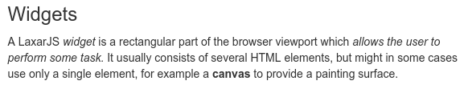

# ax-html-display-widget [](https://travis-ci.org/LaxarJS/ax-html-display-widget)

Sanitizes and displays HTML content from a resource.

## Content
* [Appearance](#appearance)
* [Usage](#usage)
* [Features](#features)
* [Integration](#integration)
* [References](#references)


## Appearance


An ax-html-display-widget displaying a text with a headline received through a resource.


## Usage

### Installation
For installation instruction take a look at the [LaxarJS documentation](https://github.com/LaxarJS/laxar/blob/master/docs/manuals/installing_widgets.md).


### Configuration example
```json
{
   "widget": "laxarjs/ax-html-display-widget",
   "features": {
      "content": {
         "resource": "info",
         "attribute": "nonLocalized"
      }
   }
}
```
Use this configuration on a page to get an ax-html-display-widget which shows the HTML-Content from the resource "info".

For full configuration options refer to the [widget.json](widget.json).

## Features

### 1. Illustrated Content (content)
*R1.1* The widget MUST allow a configuration of a resource with HTML content.
It MUST act as a slave of the resource according to the master/slave pattern.

*R1.2* The widget MUST allow a configuration of an attribute which refers to the HTML content in the resource.

*R1.3* The resource MUST be interpreted as (possibly internationalized) HTML content.

### 2. Support of Internationalization (i18n)
*R2.1* The widget MUST allow the configuration of a *locale* as described in the documentation to [LaxarJS i18n].
When displaying internationalized content, the widget MUST use the current language tag of the locale.


## Integration
### Patterns
The widget supports the following event patterns as specified by the [LaxarJS Patterns] document.

#### Resources
* Resource: `content.resource`
   * Role: Slave
   * Access: Read/Write
   * Description: Provides the HTML content, which should be displayed.


## References
The following sources are useful or necessary for the understanding of this document.
The links refer to the latest version of the documentation.
Refer to the bower.json for the specific version that is normative for this document.

* [LaxarJS Concepts]
* [LaxarJS Patterns]
* [LaxarJS i18n]

[LaxarJS Concepts]: https://github.com/LaxarJS/laxar/blob/master/docs/concepts.md "LaxarJS Concepts"
[LaxarJS Patterns]: https://github.com/LaxarJS/laxar_patterns/blob/master/docs/index.md "LaxarJS Patterns"
[LaxarJS i18n]: https://github.com/LaxarJS/laxar/blob/master/docs/manuals/i18n.md "LaxarJS i18n"
