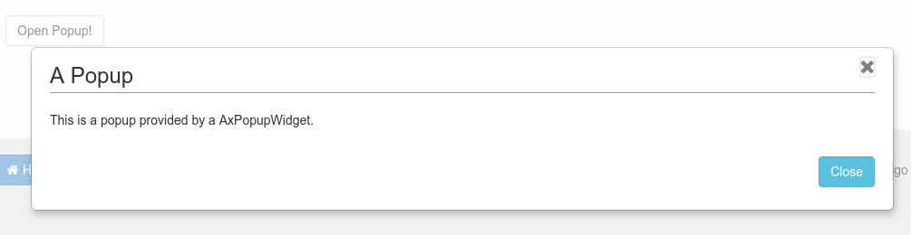

# AxPopupWidget [](https://travis-ci.org/LaxarJS/ax-popup-widget)
Shows a modal popup with content areas for other widgets.

## Content
* [Appearance](#appearance)
* [Usage](#usage)
* [Features](#features)
* [Integration](#integration)
* [References](#references)

## Appearance


An AxPopupWidget with displays a popup with a headline and a text.


## Usage
### Installation
For installation instruction take a look at the [LaxarJS documentation](https://github.com/LaxarJS/laxar/blob/master/docs/manuals/installing_widgets.md).

### Configuration Example
```json
"popups": [
   {
      "widget": "laxarjs/ax-popup-widget",
      "id": "myPopup",
      "features": {
         "content": {
            "layout": "popups/my-popup-content"
         },
         "open": {
            "onActions": [
               "openPopup"
            ]
         },
         "close": {
            "onActions": [
               "closePopup"
            ]
         },
         "closeIcon": {
            "enabled": true
         }
      }
   }
],
"myPopup.header": [
   {
      "widget": "laxarjs/ax-headline-widget",
      "features": {
         "headline": {
            "i18nHtmlText": "A Popup"
         }
      }
   }
]
```

Use this configuration on a page to get a AxPopupWidget instance.
The AxPopupWidget must be in the widget area `popups` which is a special area provided by the theme.
The AxPopupWidget defines its own section named by its ID `myPopup` plus the widget areas defined in the configured layout such as `header`.
In this example only one AxHeadlineWidget is added with the headline "Popup Title" to the widget area `myPopup.header`.
If the popup is displayed a headline "Popup Title" is displayed inside of it.


For full configuration options refer to the [widget.json](widget.json).

## Features
### 1. Display a Popup
*R1.1* The widget MUST have a border styled by the theme.

*R1.2* The widget MUST have a background styled by the theme.

*R1.3* If the popup is displayed, the page in the background MUST be blocked for interaction.
The visual effect to display this MUST be implemented through the theme.

*R1.4* If the popup is displayed, a CSS class on the body MUST be set.

### 2. Position on the Page (position)
*R2.1* The widget MUST expect to be in a widget area which is upper than the normal page content but deeper than any popovers.

*R2.2* The area MUST be defined by the theme.

*R2.3* The widget MUST be displayed in the center of the window (or iframe) and independently of the actual scroll position of the covered page.

*R2.4* If possible the widget MUST determine its height big enough for its content but small enough to be displayed on the page as one piece.
If not possible the widget MUST display a inner scroll bar and adjust the width.
The widget does not need to accommodate for content that is wider than the page.

*R2.5* The widget MUST allow the configuration of two types of vertical positions.
In case of the first option the widget MUST be in the middle of the page and does not scroll with the content of the page.
The second option is the top position of the page.
In this case the widget scrolls with the content of the page and MUST NOT have a scroll bar.

### 3. Open the Popup (open)
*R3.1* The widget MUST open the popup if it is triggered through a configured action event.
The event MUST include the DOM ID of the anchor element.
The widget MUST confirm the action with an event.

### 4. Visibility (visibility)
*R4.1* A flag MUST be configurable.
If the flag is configured the widget MUST report the visibility of the popup with this flag.

*R4.2* It MUST be configurable if the popup has a very high value for its CSS property `z-index`.
The value is provided by the theme.

*R4.3* The widget MUST handle visibility requests for the widget areas inside of its layout in relation to its own visibility.

*R4.4* When the widget visibility is changed, new visibility requests for the affected widget areas MUST be send.

### 5. Closing the Popup (close)
*R5.1* The widget MUST close the popup if it is triggered through a configured action event.
The widget MUST confirm the action with an event.

### 6. Closing the Popup through an Icon and the keyboard (closeIcon)
*R6.1* It MUST be possible to disable this feature.

*R6.2* If the ESC key is pressed the popup MUST be closed.
The widget MUST prevent the key default action.

*R6.3* The widget MUST display a close icon in its border.
The style of the icon is determined by the theme.

### 7. Forced Close of the Popup (forcedClose)
*R7.1* If the popup is closed by the close icon or the ESC key or a backdrop click, a configured action MUST be triggered.
The event MUST include the DOM ID which was used to create the popup.

### 8. Providing a Content Area (content)
*R8.1* The widget MUST load a configurable layout and display the areas which are defined in this layout.
Every of these content areas MUST be able to include widgets.

*R8.2* The width of the widget MUST correspond to the width of the layout plus the width of the border.

### 9. Set the Focus automatically (autoFocus)
*R9.1* It MUST be configurable if the widget must set the focus on the first suitable content element.
The `tabindex` attribute of the content elements MUST be considered.

*R9.2* If the focus is not set automatically, the widget MUST remove the focus from the currently active element (`element.blur()`).

*R9.3* The widget MUST remember the element which loses focus.
When the popup is closed, the element MUST be focused again.

### 10. Limit Tab Navigation (captureFocus)
*R10.1* The widget MUST disable the tab navigation to elements of widgets which are in the page below the popup.
The widget MUST allow the navigation to the elements below through configuration.

*R10.2* It MUST be possible to navigate with the tab key from the last suitable element to the first suitable element of the AxPopupWidget and its included widgets.
The `tabindex` attribute of the child DOM elements MUST be considered.

### 11. Prevent the Body Scrolling (preventBodyScrolling)
*R11.1* It MUST be configurable if the AxPopoverWidget prevents the scrolling of the body element when displaying its popover.
The default is to prevent the scrolling.

### 12. Closing the Popup by a Click of the Backdrop (backdropClose)
*R12.1* The widget MUST allow to close the popup by clicking the backdrop.
It MUST be possible to disable this feature.


## Integration
### Patterns
The widget supports the following event patterns as specified by the [LaxarJS Patterns] document.


#### Actions
* Action: `open.onAction`
   * Role: Receiver
   * Description: Trigger to make the popup visible.


* Action: `close.onAction`
   * Role: Receiver
   * Description: Trigger to make the popup invisible.


* Action: `forcedClose.action`
   * Role: Sender
   * Description: Report the closing of the popup by user interaction


#### Flags
* Flag: `visibility.flag`
   * Role: Sender
   * Description: The flag is `true` while the popup is visible.


#### Visibility
The widget manages visibility events for the areas from the configured layout (`content.layout`).


## References
The following resources are useful or necessary for the understanding of this document.
The links refer to the latest version of the documentation.
Refer to the [bower.json](bower.json) for the specific version that is normative for this document.

* [LaxarJS Concepts]
* [LaxarJS Patterns]


[LaxarJS Concepts]: https://github.com/LaxarJS/laxar/blob/master/docs/concepts.md "LaxarJS Concepts"
[LaxarJS Patterns]: https://github.com/LaxarJS/laxar_patterns/blob/master/docs/index.md "LaxarJS Patterns"
