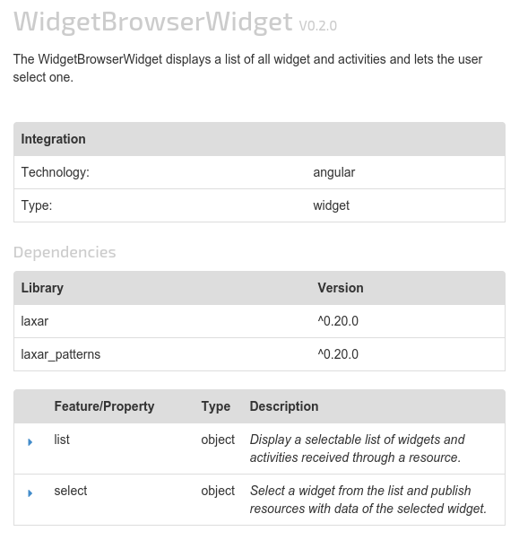

# AxWidgetInformationWidget
The AxWidgetInformationWidget presents details of a widget or activity.
It displays the name, the version and further information like the type of integration, dependencies and the features.
The information is based on the technical specification *widget.json* and the bower manifest *bower.json*.

## Content
* [Appearance](#appearance)
* [Usage](#usage)
* [Features](#features)
* [Integration](#Integration)
* [References](#references)

## Appearance


In this example the widget displays information about the WidgetBrowserWidget.
The widget displays the name, the version, a description of the widget, the integration details, the dependencies and a table with all features in this case two.
Both features have properties which are collapsed and can be shown by a click on one of the carets.


## Usage

### Installation
For installation instruction take a look at the [LaxarJS documentation](https://github.com/LaxarJS/laxar/blob/master/docs/manuals/installing_widgets.md).

### Configuration example
```json
{
   "widget": "laxarjs/widget-information-widget",
   "features": {
      "widget": {
         "resource": "widgetInformation"
      },
      "bower": {
         "resource": "widgetBowerConfiguration"
      }
   }
}
```
Use this configuration on a page to get an AxWidgetInformationWidget instance.
The widget expects two resources, one with the topic `widgetInformation` and with the content of a `widget.json` of a widget and the other resource with the topic `widgetBowerConfiguration` with the content of a `bower.json` of a widget.
The data of the resources are the base for the presentation.

For full configuration options refer to the [widget.json](widget.json).

## Features

### 1. Display Details about a Widget from his Widget Information (widget)
*R1.1* The widget MUST display information about a widget or activity (below both called as widget).
The AxWidgetInformationWidget gets these information about the widget from a configurable resource.
The AxWidgetInformationWidget MUST act as a *slave* of the resource according to the master/slave pattern.

*R1.2* The widget MUST interpret the data of the resource like the content of a `widget.json` file.

*R1.3* The widget MUST display the name of the widget, its description and the version.
If there is no version then the text `Unspecified` MUST be displayed.

*R1.4* The widget MUST display the integration technology (e.g. angular) and the type (e.g. activity).

*R1.5* The AxWidgetInformationWidget MUST list every feature  of the widget with their properties and their descriptions.

### 2. Display Details about a Eidget from his Bower Configuration (bower)
*R2.1* The widget MUST allow a configuration of a bower resource.
The widget MUST expect that the content of the resource has the content of a `bower.json` file.
The AxWidgetInformationWidget MUST act as a *slave* of the resource according to the master/slave pattern.

*R2.2* If the feature *bower* is configured, the AxWidgetInformationWidget MUST display the version of the widget from the *bower* resource instead of the version from the *widget* resource.

*R2.3* The widget MUST display the dependencies from the *bower* resource.


## Integration
### Patterns
The widget supports the following event patterns as specified by the [LaxarJS Patterns] document.

#### Resources
* Resource: widget.resource
* Role: Slave
* Access: Read
* Description: The resource with the information about the widget.

* Resource: bower.resource
* Role: Slave
* Access: Read
* Description: The resource with the bower configuration of the widget.

## References
The following resources are useful or necessary for the understanding of this document.
The links refer to the latest version of the documentation.
Refer to the bower.json for the specific version that is normative for this document.

* [LaxarJS Concepts]
* [LaxarJS Patterns]

[LaxarJS Concepts]: https://github.com/LaxarJS/laxar/blob/master/docs/concepts.md "LaxarJS Concepts"
[LaxarJS Patterns]: https://github.com/LaxarJS/laxar_patterns/blob/master/docs/index.md "LaxarJS Patterns"
